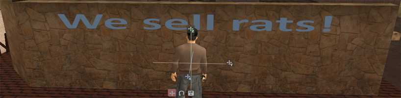

# Graffiti System

[[toc]]

:::warning WIP
This part of the feature documentation is still a WIP.
:::

| Feature Name    | Developer | Version Released | Documentation Updated  |
| --------------- | --------- | ---------------- | ---------------------- |
| Graffiti System | TommyB    | 2.5              | 25th of September 2018 |

### Summary

The graffiti system was introduced in Version 2.5 as an addition to the lineup of features for illegal factions. It is an enhanced version to the former tag system, which was introduced in Version 2.4, and later disabled in Version 2.4 R2.

The development of the graffiti system started in mid-2014, but its implementation had to be postponed multiple times due to unforeseen circumstances. After two years of consideration, the development team introduced a basic 'tag' system in Version 2.4, where players were allowed to place a descriptive text label at any location around the map. Unfortunately, the system was disabled in Version 2.4 R2 due to multiple incidents of misusing the system.

With the system making a return in Version 2.5, it has been decided to keep this feature exclusive to official illegal factions in order to moderate the number of graffiti placed around the server. This feature was scripted using basic resources that is available from San Andreas Multiplayer.

### Core Feautures

The graffiti system allow players from official illegal factions to attach text on any location. You will also need to have a spray can in your possession, which can be purchased at any general shop.

To add a graffiti, stand in front of a wall and equip your spray can. Once ready, use the '/tag' command to trigger a dialog box, where you will be given various options to design your graffiti. These options are as follows:

- **Tag Object** - This option allows you to set the size (object) of the graffiti. Each option varies by size.
- **Tag Text** - This option allows you to input the tag that will appear in the graffiti. You can use ~n~ to insert a line break between your graffiti text.
- **Tag Font** - This option allows you to choose the font of your graffiti.
- **Tag Text Size** - This options allows you to choose the size of your graffiti text. The size ranges between 1 to 255.
- **Tag Text Color** - This option allows you to choose a text color from the default color choices. You can also customize it by indicating your preferred color in RGB format.
- **Tag Text Bold** - This option will make your graffiti text bold. Choosing the option again will disable the boldness of the text.

---

Once you are satisfied with the text and design, select "Spawn Tag" to see a preview of the graffiti. The object editor will also pop up and you will be able to adjust the position and rotation of the graffiti. When you are finish with the positioning, click the save icon and the graffiti will save. Pressing 'ESC' will bring you back to the dialog box shall you wish to continue editing the graffiti. You can use '/edittag' to edit your graffiti. If your graffiti is not aligned, you can use '/aligntag' to perfectly align your tag to a canvas. (e.g walls)

Please ensure that the graffiti content and attachment is realistic; otherwise, it will be considered as abuse of the system and you will be permanently banned from the server. 

**Graffiti Object Choices:**
- Tiny Rectangle
- Small Rectangle
- Medium Rectangle
- Medium Strip
- Small Square

**Font Choices:**
- Arial
- Courier
- Calibri
- Engravers MT
- Quartz MS
- Segoe Keycaps
- Fixedsys

### Related Commands

- **/tag** - Allows an illegal faction member to create a tag.
- **/edittag** - Allows any member in your faction to edit a tag placed by you or another faction member.
- **/deletetag** - Allows any member in your faction to remove a tag created by you or another faction member.
- **/aligntag** - Allows any member in your faction to perfectly align a tag to a canvas created by you or another faction member.