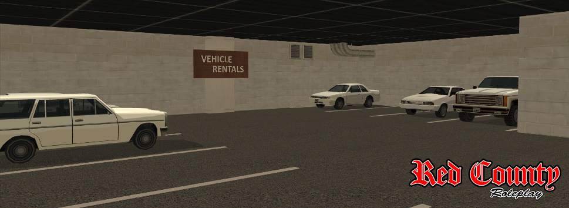

# Obtaining a Vehicle

There's a couple ways for you to obtain a vehicle, some being less legal than the others. First two of the means listed below are permanent (the car is legally yours and you receive access to all commands reserved for vehicle owners), while the remaining three limit you in one way or another.

[[toc]]

## Dealerships

The most obvious way of purchasing a vehicle is via a dealership. At the moment we have three dealerships on Red County Roleplay - cars can be purchased at the Dillimore Vehicle Dealership, motorbikes at Mr Grant's Bike Shed (also in DIllimore), and boats at the Bayside Marina. 

It is currently not possible to purchase pushbikes, helicopters or airplanes. Some vehicles might also not be available in the dealerships, but still be available as donator vehicles - and some are completely restricted (e.g police vehicles or vehicles with mounted guns). Prices at the dealerships might be seen as somewhat high compared to the prices on the market (player to player sales), which is understandable because you're purchasing a brand new vehicle and you can do that whenever you please, without the need to wait till someone is selling a vehicle you desire. 

In order to view the available vehicles and their prices you can use /viewstock (while standing on the yellow 'i' icon at a dealership), and to preview and possibly purchase a vehicle you can use /viewcars (or alternatively /viewbikes and /viewboats). While you need at least one free vehicle slot to use the latter, the /viewstock command can be used even if all your slots are taken, making it an useful tool for estimating the market value of your car before you try selling it.

## Other Players
Players often advertise selling their vehicles, usually either via in-game advertisements (dark green lines in your chat with [ADVERT] at the beginning) or via the forum section called Marketplace. Whether you get in contact with the seller via forums or by calling their phone in-game - you'll need to meet up and finalize the sale in person. In this situation the price of the vehicle fully depends on what you and the seller agree on. In order to sell your vehicle to a player you have to use /sell vehicle, which will show you a list of your vehicles with their IDs - then use /sell vehicle [player ID or name] [ID from the list] [price]. The buyer will need to accept it via /accept vehicle, after which the car becomes theirs.

## Rentable Vehicles

The rental lot can be found in an underground parking lot of the Montgomery Information Center (opposite the trailer park newbie spawn). To rent a vehicle all you have to do is enter one you like and use /rentvehicle while inside. You will be charged an appropriate amount (shown in your chat upon entering the car) and the car will be yours to drive. If you don't return the car within an hour - you'll be automatically charged the same amount again. In order to return the vehicle drive back to the rental lot and use /returnvehicle. You will be charged additionally for repairs if the car is damaged upon returning.

## Stealing
You are able to steal a vehicle from a player. If they leave a car with the engine on and the doors unlocked - all you have to do is enter it and drive away. If the car is parked and unlocked - you can enter it and use /hotwire in order to hotwire it, but you'll need a toolbox in order to do that (which can be purchased at one of the mechanics stores, for example at the Palomino Creek Garage). The hotwiring can be successful or not, you can try again in case you fail. Remember that if the vehicle is locked - you are not able to steal it in any way. You are also not able to steal faction-owned vehicles.
